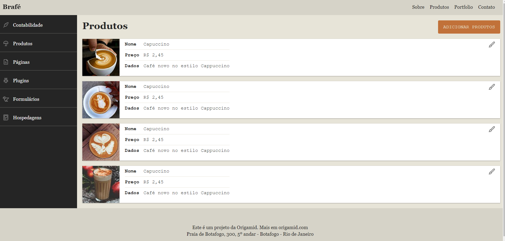

# brafe-3

<h1 align="center">
    
</h1>

Site desenvolvido durante o curso de CSS avançado da Origamid para aprofundar o conhecimento sobre posicionamento dos elementos do HTML. Inicialmente o site foi construído do zero utilizando HTML e CSS puro, com floats e clearfix para posicionamento dos elementos. Posteriormente ele foi refeito mais 3 vezes: 1 - utililizando um sistema de grid; 2 - utilizando flexbox; 3 - utilizando Bootstrap*.

*não fiz o commit do Bootstrap, pois utilizei apenas para estudo e teria que modificar várias estruturas para adequar o conteúdo ao framework.
